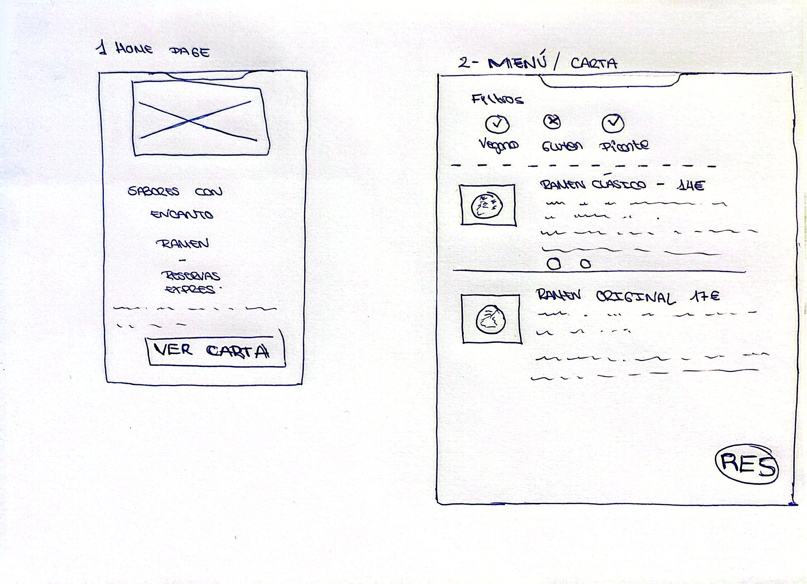

# DIU26
Prácticas Diseño Interfaces de Usuario  (Tema: Gastronomía / Sabores con encanto - DIU1 Anime Ramen)

* [Guiones de prácticas](GuionesPracticas/)
* [Guía para crea tu Case Study](Guia_CaseStudy.md)
* Sala de la Fama [DIU Hall of fame](https://github.com/mgea/DIU/tree/master/hall_of_fame) donde se pueden encontrar Case Study destacados de otros años.
* [Recursos/plantillas en figma](https://www.figma.com/design/BN2IR0q2clOSplfMmalh9K/DIU_Toolkit_Framework--2026-)

Actualizado: 19/03/2026

## Paso 0 My UX-Case Study
 
-----

Grupo: DIU1.PGduo.  Curso: 2025/26 

Nombre del Proyecto: Pendiente de definición en la Práctica 2

Descripción: Pendiente de definición en la Práctica 2

Logotipo: Pendiente de definición en la Práctica 3

Miembros y nombre del equipo:
 * :bust_in_silhouette:  Pablo Anel Rancaño         :octocat: [pabloanelrancano](https://github.com/pabloanelrancano)
 * :bust_in_silhouette:  Germán Morcillo Jimenez    :octocat: [germanmorcillo](https://github.com/germanmorcillo)

----- 

 

# Proceso de Diseño 

 

## Paso 1. UX User & Desk Research & Analisis 

### 1.a User Reseach Plan

-----

Para investigar la web del restaurante **Anime Ramen**, nos hemos centrado en tres aspectos: la facilidad para consultar la carta, la claridad sobre ubicación y contacto, y lo intuitivo que resulta el proceso de reserva. En un primer lugar, somos conscientes de que, el fuerte peso de la estética anime y de los elementos visuales, pueden dificultar tareas básicas como consultar precios, revisar la carta o avanzar hacia la reserva, especialmente en móvil.

Como referencia de usuarios, se consideraron perfiles jóvenes atraídos por la temática visual y perfiles más interesados en la oferta gastronómica y en la rapidez del proceso. El plan sirvió como base para el análisis competitivo, la definición de personas, los journey maps y la revisión heurística posterior.

### 1.b Competitive Analysis
 
-----

Para el análisis competitivo, nuestro grupo seleccionó como caso principal la web de **Anime Ramen**, ya que encaja directamente con la temática asignada y ofrece una propuesta muy reconocible, además de permitir realizar acciones importantes para el usuario, como consultar la carta, localizar el restaurante o acceder a la reserva.

Como referencia se comparó **Anime Ramen** con **Ramen Kagura** y **Ramen Komainu**, dos restaurantes de ramen que permiten contrastar enfoques distintos. Ramen Kagura destaca por una web más clara y estructurada, con una propuesta más tradicional y confiable, mientras que Ramen Komainu presenta una imagen más artesanal y auténtica. Frente a ellos, Anime Ramen sobresale por su carácter más llamativo, aunque también presenta una interfaz más densa y una jerarquía visual menos limpia.

Esta comparativa permitió justificar la elección de Anime Ramen como caso principal y detectar oportunidades de mejora relacionadas con la claridad de la información, la experiencia de navegación y la orientación a las acciones principales del sitio.

### 1.c Personas
 
-----

**1. Mateo Santos (Estudiante y fan del anime):** representa un público joven atraído por la estética anime y por una experiencia social y visual para compartir con amigos. Usa principalmente el móvil, quiere comprobar rápido si el sitio le llama la atención, revisar la carta con precios visibles y decidir si merece la pena reservar. Al tener un presupuesto ajustado, se frustra cuando la web resulta lenta, cargada o poco clara.

 
-----

**2. Laura Gómez (Profesional pragmática):** representa un público más adulto, organizado y que prefiere la eficiencia. Valora su tiempo, la calidad de la comida y la claridad de la información, por lo que necesita una interfaz limpia, una carta fácil de consultar y datos útiles sobre ingredientes u opciones relevantes. Para este perfil, la reserva online debe ser rápida, fiable y sin complicaciones.

### 1.d User Journey Map

 
----

El primer **User Journey Map** se basa en **Mateo Santos**, el usuario joven y fan del anime que, entra en la web desde el móvil tras una recomendación de sus amigos. Su objetivo es comprobar rápidamente si **Anime Ramen** le convence, fijándose sobre todo en la estética del sitio, la carta con precios visibles (y asquibles) y la posibilidad de reservar o decidir con rapidez.

El recorrido muestra una situación habitual, la cual es, descubrir un restaurante, revisar si encaja con el plan, consultar carta y precios y valorar una posible reserva. La web funciona bien como elemento de atracción inicial, pero aparecen fricciones cuando el usuario necesita consultar información práctica de forma rápida. En especial, la densidad visual, la jerarquía de la información y la falta de claridad en algunas acciones dificultan la toma de decisiones.

**Conclusión:** Anime Ramen destaca por su identidad visual y capacidad de atraer, pero necesita mejorar la claridad de la carta.

 
----

El segundo **User Journey Map** es de **Laura Gómez**, una usuaria más orientada a la eficiencia. Su objetivo es revisar la carta con rapidez, encontrar información útil y completar una reserva sin perder tiempo. En este caso, el recorrido se centra menos en la parte emocional y más en la claridad, la utilidad y la confianza que transmite la interfaz.

Este mapa refleja también una situación muy frecuente en webs de restauración, entrar con una intención concreta, comprobar si la oferta encaja y completar una acción. La web transmite personalidad, pero para este perfil todavía puede mejorar en legibilidad, contenidos y visibilidad de la reserva.

**Conclusión:** para usuarios más funcionales, Anime Ramen necesita una experiencia más clara, directa y orientada a la tarea.

### 1.e Usability Review
 
----

La revisión de **Anime Ramen** se realizó mediante la checklist de usabilidad propuesta en la práctica, teniendo en cuenta también las necesidades detectadas en las personas y en los journey maps. El resultado global obtenido fue de **58/100**, con una valoración **Moderate**.

La evaluación muestra, como principal fortaleza, la identidad visual del sitio, ya que desde el inicio se entiende bien el concepto de restaurante temático. Sin embargo, también aparecen debilidades importantes: una interfaz visualmente intensa, jerarquía mejorable, dificultades para escanear con rapidez la carta y una reserva que podría ser más clara y directa.

**Evidencia de la revisión:** [Usability Review PDF](P1/Usability-review-template-Anime-Ramen.pdf)  
**Valoración numérica obtenida:** 58/100  
**Conclusión:** Anime Ramen destaca por su personalidad y capacidad de atraer, pero necesita mejorar en claridad, legibilidad y orientación a la tarea.

### 1.f Briefing

La práctica se ha centrado en el análisis UX y de usabilidad de la web de **Anime Ramen**, seleccionada como caso principal por combinar una propuesta visual muy diferenciada, con tareas relevantes, como consultar la carta, localizar información útil o acceder a la reserva. A partir del research plan, el análisis competitivo, las personas y los journey maps, se ha observado que la web destaca especialmente por su capacidad para transmitir una identidad de marca reconocible y atractiva, alineada con una experiencia temática coherente.

Sin embargo, la revisión de usabilidad también ha permitido detectar debilidades. Las principales se relacionan con la densidad visual de algunas secciones, la jerarquía, la legibilidad y la dificultad para acceder con rapidez a contenidos clave como la carta, los precios o la acción de reserva. Esto afecta de forma distinta según el perfil de usuario, es decir, que mientras que los usuarios más emocionales toleran mejor la carga visual, otros perfiles encuentran más complicaciones en la orientación a la tarea.

En conjunto, Anime Ramen funciona bien como propuesta de atracción y marca, pero necesita una experiencia más clara, directa y equilibrada para mejorar su eficacia en las tareas principales.

 

## Paso 2. UX Design  

### 2.a Reframing / Ideación: Feedback Capture Grid
 
----

| Interesante (Aspectos positivos) | Críticas constructivas |
| :--- | :--- |
| **Identidad visual:** la temática y el estilo del sitio ayudan a captar la atención y a transmitir una experiencia diferenciada.  **Atractivo para el público joven:** la propuesta conecta especialmente bien con usuarios como Mateo, que valoran la estética y el componente social del restaurante. | **Carga visual elevada:** el exceso de elementos dificulta el acceso rápido a la información, sobre todo en móvil.  **Experiencia fragmentada:** la consulta de la carta no se integra del todo con la navegación principal, lo que rompe la continuidad de la experiencia.  **Información insuficiente:** la falta de claridad sobre opciones alimentarias y detalles relevantes complica la experiencia de perfiles como Laura. |
| **Preguntas de los usuarios** | **Nuevas ideas (Propuestas)** |
| *Mateo:* “¿Puedo decidir rápido si merece la pena ir?”  *Laura:* “¿Hay opciones vegetarianas? ¿Puedo reservar mesa sin perder tiempo?” | **Carta integrada en la experiencia:** Menú accesible desde la propia web, sin romper la navegación principal.  **Filtros útiles:** Posibilidad de filtrar por vegetariano, sin gluten u otras preferencias relevantes.  **Reserva exprés:** Proceso breve y claro, centrado en los datos justos para completar la acción. |

**Problema detectado:**  
A partir del análisis realizado en la Práctica 1, observamos que webs como Anime Ramen consiguen atraer por su propuesta visual y temática, pero no siempre acompañan bien al usuario en tareas clave como consultar la carta, que esta esté integrada, encontrar información útil o completar una reserva, especialmente desde el móvil.

**Hipótesis de diseño:**  
Diseñamos una propuesta que mantenga el atractivo visual del restaurante, pero priorice la claridad de la información, una carta mejor integrada en la navegación y un proceso de reserva más directo, podremos mejorar la experiencia de uso y facilitar que más usuarios completen las acciones principales del sitio.

### 2.b ScopeCanvas

----

>>> Propuesta de valor, pero ahora en vez de un texto es un ScopeCanvas que has subido a P2/ y enlazado desde aqui. Tambien vale una imagen miniatura del recurso.
>>> No olvides que tu propuesta ya tiene un nombre corto y puedes actualizar la cabecera de este archivo

### 2.b User Flow (task) analysis 
 
-----

>>> Definir "User Map" y "Task Flow" ... enlazar desde P2/ y describir brevemente

### 2.c IA: Sitemap + Labelling 

Para estructurar la información de "Sabores con Encanto", hemos optado por una navegación plana y directa, priorizando el acceso rápido a la carta y a las reservas desde cualquier punto de la web.

**Sitemap (Mapa del sitio):**
- Inicio (Home)
  - La Carta (Menú digital)
    - Filtros: Vegano, Sin Gluten, etc.
  - Reservas
    - Formulario exprés
    - Confirmación
  - Sobre Nosotros (Nuestra historia)
  - Contacto y Ubicación

**Labelling (Etiquetado):**
Hemos seleccionado términos claros, evitando tecnicismos o palabras confusas en japonés (como pasaba en Anime Ramen), para que cualquier usuario sepa exactamente qué va a encontrar.

| Término / Etiqueta | Significado / Acción | Icono propuesto |
| :--- | :--- | :--- |
| **Inicio** | Volver a la página principal | Icono de casa / Logo del local |
| **Ver Carta** | Acceder al menú interactivo | Icono de un bol de ramen / cubiertos |
| **Reservar Mesa** | Iniciar el formulario de reserva | Icono de calendario con un reloj |
| **Filtro: Vegano** | Mostrar solo platos sin carne/lácteos | Icono de una hoja verde |
| **Filtro: Sin Gluten** | Mostrar platos aptos para celíacos | Icono de espiga tachada |
| **Ubicación** | Ver mapa y dirección del local | Icono de un pin de mapa (Location) |
| **Confirmar Reserva** | Enviar los datos del formulario | Botón destacado / Icono de check (✓) |

### 2.d Wireframes
 
-----

Para esta sección hemos optado por un diseño "Mobile First", priorizando la rapidez y claridad que nos exigía nuestro usuario objetivo.

**1. Boceto en Papel**
Primero plasmamos la idea principal en papel para estructurar la información de la Home y la Carta con los filtros de alérgenos:

 

## Paso 3. Mi UX-Case Study (diseño)

>>> Cualquier título puede ser adaptado. Recuerda borrar estos comentarios del template en tu documento

### 3.a Moodboard

-----

>>> Diseño visual con una guía de estilos visual (moodboard) 
>>> Incluir Logotipo. Todos los recursos estarán subidos a la carpeta P3/
>>> Explique aqui la/s herramienta/s utilizada/s y el por qué de la resolución empleada. Reflexione ¿Se puede usar esta imagen como cabecera de Instagram, por ejemplo, o se necesitan otras?

### 3.b Landing Page
 
----

>>> Plantear el Landing Page del producto. Aplica estilos definidos en el moodboard

### 3.c Guidelines
 
----

>>> Estudio de Guidelines y explicación de los Patrones IU a usar 
>>> Es decir, tras documentarse, muestre las deciones tomadas sobre Patrones IU a usar para la fase siguiente de prototipado. 

### 3.d Mockup
 
----

>>> Consiste en tener un Layout en acción. Un Mockup es un prototipo HTML que permite simular tareas con estilo de IU seleccionado. Muy útil para compartir con stakeholders

 

## Paso 4. Pruebas de Evaluación 

### 4.a Reclutamiento de usuarios 

-----

>>> Breve descripción del caso asignado (llamado Caso-B) con enlace al repositorio Github
>>> Tabla y asignación de personas ficticias (o reales) a las pruebas. Exprese las ideas de posibles situaciones conflictivas de esa persona en las propuestas evaluadas. Mínimo 4 usuarios: asigne 2 al Caso A y 2 al caso B.

| Usuarios | Sexo/Edad     | Ocupación   |  Exp.TIC    | Personalidad | Plataforma | Caso
| ------------- | -------- | ----------- | ----------- | -----------  | ---------- | ----
| User1's name  | H / 18   | Estudiante  | Media       | Introvertido | Web.       | A 
| User2's name  | H / 18   | Estudiante  | Media       | Timido       | Web        | A 
| User3's name  | M / 35   | Abogado     | Baja        | Emocional    | móvil      | B 
| User4's name  | H / 18   | Estudiante  | Media       | Racional     | Web        | B 

### 4.b Diseño de las pruebas 
 
-----

>>> Planifique qué pruebas se van a desarrollar. ¿En qué consisten? ¿Se hará uso del checklist de la P1?

### 4.c Cuestionario SUS
 
----

>>> Como uno de los test para la prueba A/B testing, usaremos el **Cuestionario SUS** que permite valorar la satisfacción de cada usuario con el diseño utilizado (casos A o B). Para calcular la valoración numérica y la etiqueta linguistica resultante usamos la [hoja de cálculo](https://github.com/mgea/DIU19/blob/master/Cuestionario%20SUS%20DIU.xlsx). Previamente conozca en qué consiste la escala SUS y cómo se interpretan sus resultados
http://usabilitygeek.com/how-to-use-the-system-usability-scale-sus-to-evaluate-the-usability-of-your-website/)
Para más información, consultar aquí sobre la [metodología SUS](https://cui.unige.ch/isi/icle-wiki/_media/ipm:test-suschapt.pdf)
>>> Adjuntar en la carpeta P4/ el excel resultante y describa aquí la valoración personal de los resultados 

### 4.d A/B Testing
 
-----

>>> Los resultados de un A/B testing con 3 pruebas y 2 casos o alternativas daría como resultado una tabla de 3 filas y 2 columnas, además de un resultado agregado global. Especifique con claridad el resultado: qué caso es más usable, A o B?

### 4.e Aplicación del método Eye Tracking 

----

>>> Indica cómo se diseña el experimento y se reclutan los usuarios. Explica la herramienta / uso de gazerecorder.com u otra similar. Aplíquese únicamente al caso B.

  
>>> Cambiar esta img por una de vuestro experimento. El recurso deberá estar subido a la carpeta P4/  

>>> gazerecorder en versión de pruebas puede estar limitada a 3 usuarios para generar mapa de calor (crédito > 0 para que funcione) 

### 4.f Usability Report de B
 
-----

>>> Añadir report de usabilidad para práctica B (la de los compañeros) aportando resultados y valoración de cada debilidad de usabilidad. 
>>> Enlazar aqui con el archivo subido a P4/ que indica qué equipo evalua a qué otro equipo.

>>> Complementad el Case Study en su Paso 4 con una Valoración personal del equipo sobre esta tarea

 

## Paso 5. Exportación y Documentación 

### 5.a Exportación a HTML/React
 
----

>>> Breve descripción de esta tarea. Las evidencias de este paso quedan subidas a P5/

### 5.b Documentación con Storybook

----

>>> Breve descripción de esta tarea. Las evidencias de este paso quedan subidas a P5/

 

## Conclusiones finales & Valoración de las prácticas

>>> Opinión FINAL del proceso de desarrollo de diseño siguiendo metodología UX y valoración (positiva /negativa) de los resultados obtenidos. ¿Qué se puede mejorar? Recuerda que este tipo de texto se debe eliminar del template que se os proporciona 

