# DIU26
Prácticas Diseño Interfaces de Usuario  (Tema: Gastronomía / Sabores con encanto - DIU1 Anime Ramen)

* [Guiones de prácticas](GuionesPracticas/)
* [Guía para crea tu Case Study](Guia_CaseStudy.md)
* Sala de la Fama [DIU Hall of fame](https://github.com/mgea/DIU/tree/master/hall_of_fame) donde se pueden encontrar Case Study destacados de otros años.
* [Recursos/plantillas en figma](https://www.figma.com/design/BN2IR0q2clOSplfMmalh9K/DIU_Toolkit_Framework--2026-)

Actualizado: 19/03/2026

## Paso 0 My UX-Case Study
 
-----

Grupo: DIU1.PGduo.  Curso: 2025/26 

Nombre del Proyecto: RamenFlow - Anime Ramen Redesign

Descripción: Propuesta de rediseño web para un restaurante temático de ramen, de forma que mantenga la personalidad de la marca, pero mejorando la consulta de la carta, la visibilidad de la información útil y la reserva online.

Logotipo:Definido en la Práctica 3 como parte del moodboard y del sistema visual del rediseño.

  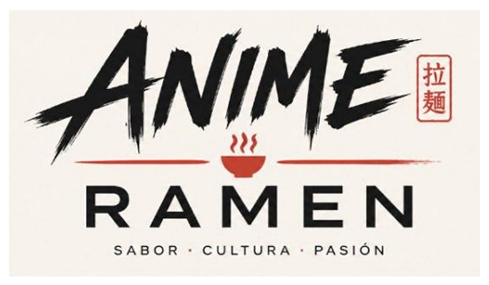
  &nbsp;&nbsp;
  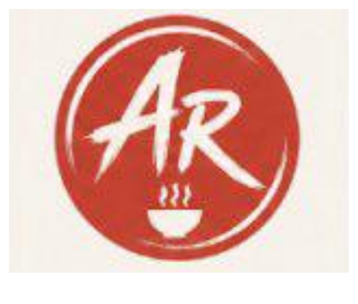
  &nbsp;&nbsp;
  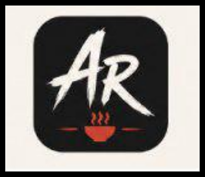

Miembros y nombre del equipo:
 * :bust_in_silhouette:  Pablo Anel Rancaño         :octocat: [pabloanelrancano](https://github.com/pabloanelrancano)
 * :bust_in_silhouette:  Germán Morcillo Jimenez    :octocat: [germanmorcillo](https://github.com/germanmorcillo)

----- 

 

# Proceso de Diseño 

 

## Paso 1. UX User & Desk Research & Analisis 

### 1.a User Reseach Plan

-----

Para investigar la web del restaurante **Anime Ramen**, nos hemos centrado en tres aspectos: la facilidad para consultar la carta, la claridad sobre ubicación y contacto, y lo intuitivo que resulta el proceso de reserva. En un primer lugar, somos conscientes de que, el fuerte peso de la estética anime y de los elementos visuales, pueden dificultar tareas básicas como consultar precios, revisar la carta o avanzar hacia la reserva, especialmente en móvil.

Como referencia de usuarios, se consideraron perfiles jóvenes atraídos por la temática visual y perfiles más interesados en la oferta gastronómica y en la rapidez del proceso. El plan sirvió como base para el análisis competitivo, la definición de personas, los journey maps y la revisión heurística posterior.

### 1.b Competitive Analysis
 
-----

Para el análisis competitivo, nuestro grupo seleccionó como caso principal la web de **Anime Ramen**, ya que encaja directamente con la temática asignada y ofrece una propuesta muy reconocible, además de permitir realizar acciones importantes para el usuario, como consultar la carta, localizar el restaurante o acceder a la reserva.

Como referencia se comparó **Anime Ramen** con **Ramen Kagura** y **Ramen Komainu**, dos restaurantes de ramen que permiten contrastar enfoques distintos. Ramen Kagura destaca por una web más clara y estructurada, con una propuesta más tradicional y confiable, mientras que Ramen Komainu presenta una imagen más artesanal y auténtica. Frente a ellos, Anime Ramen sobresale por su carácter más llamativo, aunque también presenta una interfaz más densa y una jerarquía visual menos limpia.

Esta comparativa permitió justificar la elección de Anime Ramen como caso principal y detectar oportunidades de mejora relacionadas con la claridad de la información, la experiencia de navegación y la orientación a las acciones principales del sitio.

### 1.c Personas
 
-----

**1. Mateo Santos (Estudiante y fan del anime):** representa un público joven atraído por la estética anime y por una experiencia social y visual para compartir con amigos. Usa principalmente el móvil, quiere comprobar rápido si el sitio le llama la atención, revisar la carta con precios visibles y decidir si merece la pena reservar. Al tener un presupuesto ajustado, se frustra cuando la web resulta lenta, cargada o poco clara.

 
-----

**2. Laura Gómez (Profesional pragmática):** representa un público más adulto, organizado y que prefiere la eficiencia. Valora su tiempo, la calidad de la comida y la claridad de la información, por lo que necesita una interfaz limpia, una carta fácil de consultar y datos útiles sobre ingredientes u opciones relevantes. Para este perfil, la reserva online debe ser rápida, fiable y sin complicaciones.

### 1.d User Journey Map

 
----

El primer **User Journey Map** se basa en **Mateo Santos**, el usuario joven y fan del anime que, entra en la web desde el móvil tras una recomendación de sus amigos. Su objetivo es comprobar rápidamente si **Anime Ramen** le convence, fijándose sobre todo en la estética del sitio, la carta con precios visibles (y asquibles) y la posibilidad de reservar o decidir con rapidez.

El recorrido muestra una situación habitual, la cual es, descubrir un restaurante, revisar si encaja con el plan, consultar carta y precios y valorar una posible reserva. La web funciona bien como elemento de atracción inicial, pero aparecen fricciones cuando el usuario necesita consultar información práctica de forma rápida. En especial, la densidad visual, la jerarquía de la información y la falta de claridad en algunas acciones dificultan la toma de decisiones.

**Conclusión:** Anime Ramen destaca por su identidad visual y capacidad de atraer, pero necesita mejorar la claridad de la carta.

 
----

El segundo **User Journey Map** es de **Laura Gómez**, una usuaria más orientada a la eficiencia. Su objetivo es revisar la carta con rapidez, encontrar información útil y completar una reserva sin perder tiempo. En este caso, el recorrido se centra menos en la parte emocional y más en la claridad, la utilidad y la confianza que transmite la interfaz.

Este mapa refleja también una situación muy frecuente en webs de restauración, entrar con una intención concreta, comprobar si la oferta encaja y completar una acción. La web transmite personalidad, pero para este perfil todavía puede mejorar en legibilidad, contenidos y visibilidad de la reserva.

**Conclusión:** para usuarios más funcionales, Anime Ramen necesita una experiencia más clara, directa y orientada a la tarea.

### 1.e Usability Review
 
----

La revisión de **Anime Ramen** se realizó mediante la checklist de usabilidad propuesta en la práctica, teniendo en cuenta también las necesidades detectadas en las personas y en los journey maps. El resultado global obtenido fue de **58/100**, con una valoración **Moderate**.

La evaluación muestra, como principal fortaleza, la identidad visual del sitio, ya que desde el inicio se entiende bien el concepto de restaurante temático. Sin embargo, también aparecen debilidades importantes: una interfaz visualmente intensa, jerarquía mejorable, dificultades para escanear con rapidez la carta y una reserva que podría ser más clara y directa.

**Evidencia de la revisión:** [Usability Review PDF](P1/Usability-review-template-Anime-Ramen.pdf)  
**Valoración numérica obtenida:** 58/100  
**Conclusión:** Anime Ramen destaca por su personalidad y capacidad de atraer, pero necesita mejorar en claridad, legibilidad y orientación a la tarea.

### 1.f Briefing

La práctica se ha centrado en el análisis UX y de usabilidad de la web de **Anime Ramen**, seleccionada como caso principal por combinar una propuesta visual muy diferenciada, con tareas relevantes, como consultar la carta, localizar información útil o acceder a la reserva. A partir del research plan, el análisis competitivo, las personas y los journey maps, se ha observado que la web destaca especialmente por su capacidad para transmitir una identidad de marca reconocible y atractiva, alineada con una experiencia temática coherente.

Sin embargo, la revisión de usabilidad también ha permitido detectar debilidades. Las principales se relacionan con la densidad visual de algunas secciones, la jerarquía, la legibilidad y la dificultad para acceder con rapidez a contenidos clave como la carta, los precios o la acción de reserva. Esto afecta de forma distinta según el perfil de usuario, es decir, que mientras que los usuarios más emocionales toleran mejor la carga visual, otros perfiles encuentran más complicaciones en la orientación a la tarea.

En conjunto, Anime Ramen funciona bien como propuesta de atracción y marca, pero necesita una experiencia más clara, directa y equilibrada para mejorar su eficacia en las tareas principales.

 

## Paso 2. UX Design  

### 2.a Empathy Map

----

Hemos elaborado un **Empathy Map** sobre cómo vive el usuario la experiencia actual de Anime Ramen. Esto ayuda a ordenar de forma visual lo que el usuario piensa, ve, escucha y dice o hace cuando entra en la web con la intención de consultar la carta o reservar mesa.

El mapa confirma varias ideas ya mencionadas en la práctica anterior, como que la web resulta atractiva, pero también genera fricciones cuando el usuario quiere completar tareas especificas o simples con rapidez. En especial, aparecen problemas relacionados con la carga visual, dificultad para encontrar información útil y una reserva que no siempre se percibe como directa.

**Empathy Map PDF:** [Empathy Map PDF](P2/Empathy_Customer_Map_AnimeRamen.pdf)

### 2.b Reframing / Ideación: Feedback Capture Grid
----

| Interesante (Aspectos positivos) | Críticas constructivas |
| :--- | :--- |
| **Identidad visual:** la temática y el estilo del sitio ayudan a captar la atención y a transmitir una experiencia diferente.  **Atractivo para el público joven:** la propuesta conecta con usuarios como Mateo, que valoran la estética y el componente social del restaurante. | **Carga visual elevada:** el exceso de elementos dificulta el acceso rápido a la información, sobre todo en móvil.  **Experiencia fragmentada:** la consulta de la carta no se integra del todo con la navegación principal, lo que rompe la continuidad de la experiencia.  **Información poco explotable**: aunque existen referencias a alérgenos y datos básicos, la carta no permite explorar preferencias alimentarias ni filtrar con comodidad. |
| **Preguntas de los usuarios** | **Nuevas ideas (Propuestas)** |
| *Mateo:* “¿Puedo decidir rápido si merece la pena ir?”  *Laura:* “¿Hay opciones vegetarianas? ¿Puedo reservar mesa sin perder tiempo?” | **Carta integrada en la experiencia:** menú accesible desde la propia web, sin romper la navegación.  **Filtros útiles:** posibilidad de filtrar por vegetariano, sin gluten u otras preferencias.  **Reserva exprés:** proceso breve y claro, centrado en los datos justos para completar la acción. |

**Problema detectado:**  
A partir de la Práctica 1, observamos que webs como Anime Ramen consiguen atraer por su propuesta visual y temática, pero no siempre acompañan al usuario en tareas como consultar la carta de forma fluida, encontrar información útil o completar una reserva, especialmente desde el móvil.

**Hipótesis de diseño:**  
Diseñamos una propuesta que mantenga el atractivo visual del restaurante, pero priorizando la claridad de la información, una carta mejor integrada en la navegación y un proceso de reserva más directo, mejorará la experiencia de uso y será más fácil completar las acciones principales del sitio.

### 2.c Point of View
----

A partir de la información de la Práctica 1, definimos dos puntos de vista principales que resumen las necesidades de nuestros usuarios.

**Laura necesita** consultar la carta y reservar mesa de forma rápida y clara, porque valora su tiempo y se frustra cuando la información útil no es accesible debido a los elementos visuales o pasos poco directos.

**Mateo necesita** decidir con rapidez si el restaurante le convence, porque busca una experiencia atractiva, pero también quiere ver precios, platos y acciones principales sin esfuerzo desde el móvil.

Estos diferentes puntos de vista nos ayudaron a diseñar la propuesta, y tratar de hacer una experiencia que mantenga el atractivo visual del sitio, pero que facilite mejor las tareas principales del usuario.

### 2.d ScopeCanvas
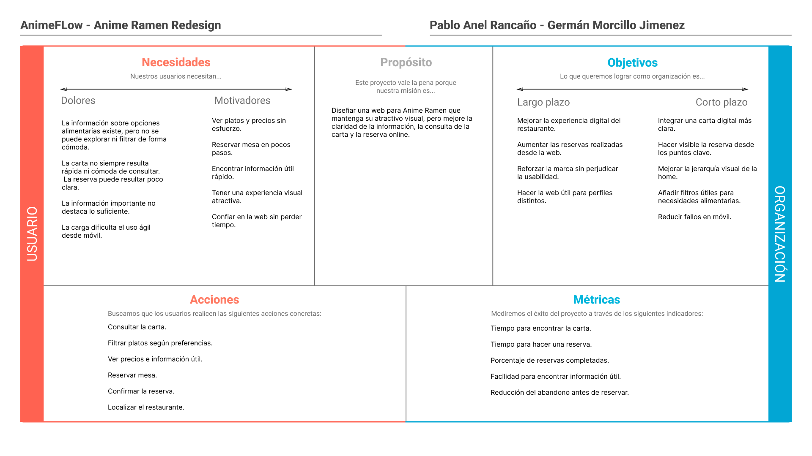
----

En el **Scope Canvas** definimos la propuesta a partir de lo observado en la práctica anterior. La propuesta se centra en mantener el atractivo visual de Anime Ramen, pero corrigiendo los principales puntos débiles detectados en la Práctica 1.

Se identificaron como prioridades, una carta más accesible, una reserva más visible y una experiencia clara tanto en móvil como en escritorio. El propósito del proyecto es ofrecer una web temática, pero mejor orientada a la tarea y más útil para perfiles distintos como Mateo y Laura. 

La propuesta se basa en tres mejoras principales: una carta digital integrada, filtros útiles según preferencias y un proceso de reserva exprés.

**ScopeCanvas PDF:** [Scope Canvas PDF](P2/ScopeCanvas_AnimeFLow_AnimeRamenRedesign.pdf)

### 2.e User Task Matrix
----

Antes de definir los flujos principales, organizamos las tareas más relevantes según los perfiles de usuario. Esta matriz nos permitió priorizar qué acciones debían resolverse con mayor claridad dentro del rediseño.

| Usuario | Tarea principal | Importancia | Observación |
| :--- | :--- | :--- | :--- |
| Mateo | Ver carta y precios | Alta | Necesita decidir rápido desde móvil |
| Mateo | Revisar platos destacados | Media | Le atrae la temática del restaurante |
| Mateo | Reservar mesa | Alta | Quiere una acción directa si el sitio le convence |
| Laura | Consultar carta con claridad | Alta | Busca información útil sin rodeos |
| Laura | Filtrar opciones relevantes | Muy Alta | Valora opciones vegetarianas o datos alimentarios |
| Laura | Reservar mesa | Muy Alta | Necesita un proceso rápido y fiable |
| Ambos | Ver ubicación y contacto | Media | Información útil |

### 2.f User Flow (task) analysis

Para el análisis de tareas se definieron dos flows principales dentro de la propuesta, consultar la carta y avanzar hacia una acción, y completar una reserva de mesa. Estos flujos nos ayudaron a ordenar mejor la experiencia y a identificar qué pasos debían ser más visibles, más directos y menos confusos que en la web actual.

### Flow I

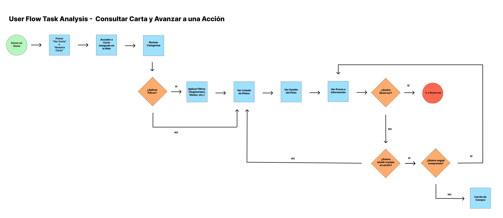
----

El primer flujo se centra en la carta, permitiendo al usuario revisar categorías, aplicar filtros según sus preferencias, ver información útil de cada plato y decidir si quiere seguir navegando, añadir productos o pasar a la reserva. Con ello se responde a una de las principales necesidades detectadas en la Práctica 1, consultar la carta de forma más clara, integrada y útil.

**Flow I PDF:** [User Flow 1 PDF](P2/UserFlowTaskAnalysis_ConsultarCartayAvanzaraunaAccion.pdf)

### Flow II

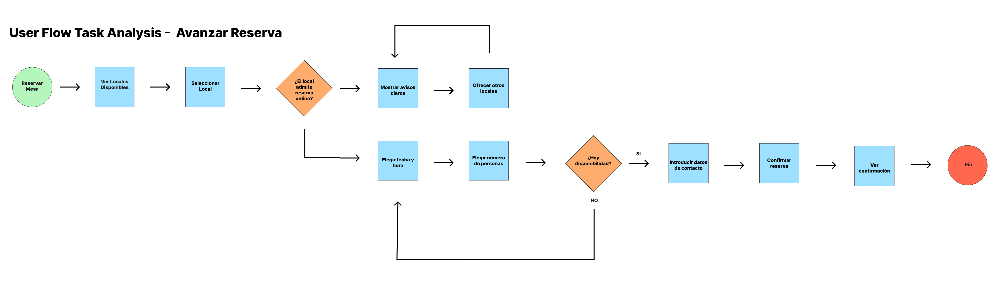
----

El segundo flujo se centra en la reserva y corrige uno de los problemas observados en el sitio actual: la existencia de locales o caminos de reserva que no siempre permiten completar la acción online con claridad. Por ello, la propuesta plantea una selección más clara de locales, mejor visibilidad de la disponibilidad y un proceso más directo hasta la confirmación final.

Ambos flujos sirvieron para definir mejor la estructura de la propuesta antes de pasar a la arquitectura de la información y al diseño de wireframes.

**Flow II PDF:** [User Flow 2 PDF](P2/UserFlowTaskAnalysis_AvanzarReserva.pdf)

### 2.g IA: Sitemap + Labelling
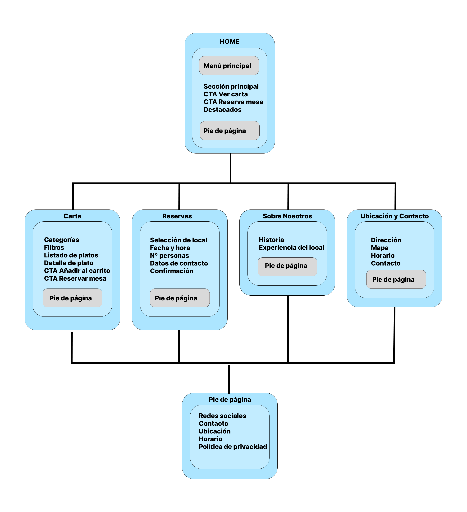
----

Para organizar bien la navegación de la propuesta y facilitar la comprensión, hemos realizado también el **sitemap** y el **labelling**.

#### Sitemap

El sitemap nos permitió definir de forma visual la estructura principal de la web y la relación entre sus apartados. En nuestro caso, se planteó una arquitectura sencilla, centrada en las tareas más importantes para el usuario. Esto ayudó a evitar una navegación recargada y a priorizar un acceso rápido a los contenidos clave.

La estructura principal se organiza en torno a cinco apartados: **Home**, **Carta**, **Reservas**, **Sobre nosotros** y **Ubicación y contacto**, además de un **pie de página** con enlaces útiles y redes sociales.

**Sitemap PDF:** [Sitemap PDF](P2/SiteMap.pdf)

#### Labelling

El labelling se centró en elegir nombres claros, directos y fáciles de entender para cada sección y acción principal de la web. Se evitaron términos ambiguos en la navegación principal, priorizando etiquetas como **Carta**, **Reservar mesa**, **Sobre nosotros**, **Ubicación** o **Contacto**, para que cualquier usuario entienda rápidamente qué puede hacer en cada apartado.

| Término / Etiqueta | Significado / Acción | Icono propuesto |
| :--- | :--- | :--- |
| **Inicio** | Volver a la página principal | Logo del local |
| **Carta** | Acceder al menú digital | Cubiertos |
| **Reservar mesa** | Iniciar el proceso de reserva | Calendario |
| **Vegetariano** | Filtrar platos aptos | Hoja |
| **Sin gluten** | Filtrar platos aptos | Símbolo tachado |
| **Ubicación** | Ver dirección y mapa | Pin de mapa |
| **Confirmar reserva** | Finalizar el proceso | Check |

### 2.h Wireframes
-----

Como parte del proceso de diseño, también desarrollamos los siguientes wireframes para definir la estructura de las pantallas principales. Estos bocetos se han planteado especialmente en formato **móvil**, ya que era una parte importante de los problemas detectados en la práctica anterior. El objetivo es organizar los contenidos, establecer una jerarquía clara y asegurar que las tareas más importantes del sitio puedan resolverse de forma directa.

A partir de la arquitectura de la información y de los flows definidos previamente, se diseñaron cuatro pantallas clave: la **home**, la **carta digital**, el **proceso de reserva** y la **confirmación de reserva**.

**Pantalla: Home Page**  
Se ha diseñado una interfaz que prioriza el acceso directo a la carta y a la reserva mediante botones claramente visibles.

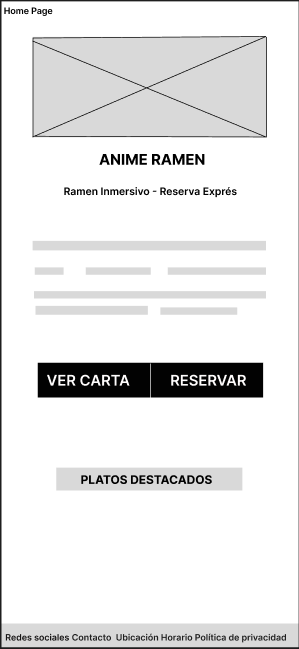

**Pantalla: Carta Digital**  
Presenta una organización por tarjetas y una navegación por categorías, incorporando filtros útiles en el primer nivel de consulta para facilitar una toma de decisiones más rápida.

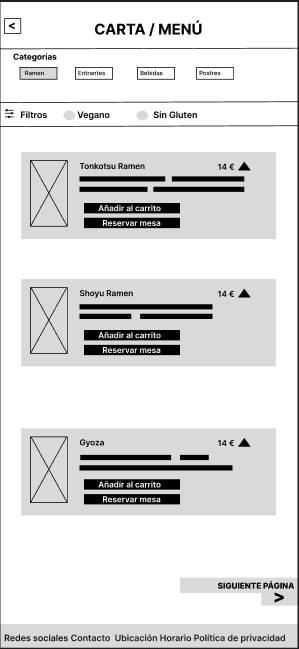

**Pantalla: Proceso de Reserva**  
Pasos guiados que organizan la información en bloques y facilitan completar la reserva con menor esfuerzo.

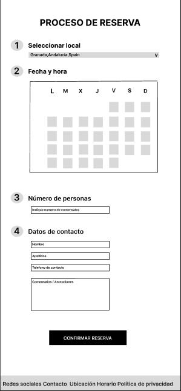

**Pantalla: Confirmación de Reserva**  
Incluye una pantalla final de confirmación que proporciona retroalimentación inmediata al usuario y cierra el flujo de reserva de forma clara.

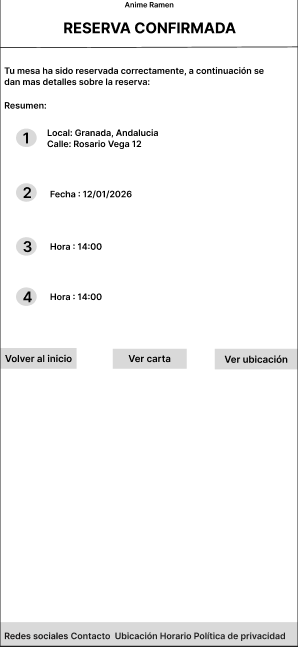

Este conjunto de wireframes permite comprobar que los flujos críticos de la propuesta, consultar la carta y reservar mesa, pueden resolverse de forma más clara, directa y coherente que en la web actual, con especial atención a la experiencia en móvil.

#### Adaptación responsive desktop

Además de los wireframes móviles, se desarrollaron tres bocetos low-fi en formato desktop con tamaño **1440 × 1024**. El objetivo fue comprobar cómo se reorganizan los flujos principales de la propuesta en una pantalla más amplia antes de pasar al diseño visual Hi-Fi de la Práctica 3.

Esta adaptación no sustituye a los wireframes móviles anteriores, sino que los complementa. Se mantienen las mismas tareas principales, como consultar la carta, revisar información útil y completar una reserva, pero aprovechando el espacio horizontal propio de escritorio para mejorar la jerarquía visual, la distribución del contenido y la claridad de navegación.

**Pantalla: Home Desktop**  
La versión desktop de la home reorganiza la pantalla en un hero de dos columnas, con el contenido principal y los botones de acción a la izquierda, y una imagen destacada a la derecha. Debajo se plantea una sección de productos destacados y un bloque informativo con ubicación, horario y contacto.

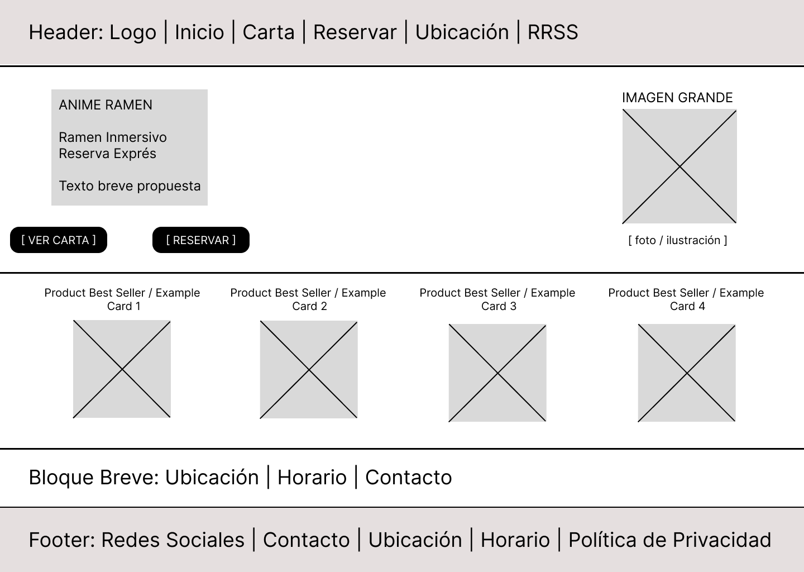

**Pantalla: Carta Desktop**  
La carta digital en escritorio se plantea con una estructura más amplia, incorporando navegación superior, categorías, filtros laterales y un grid de tarjetas de producto. Esta decisión permite comparar platos con mayor facilidad y mejorar la exploración de la carta.

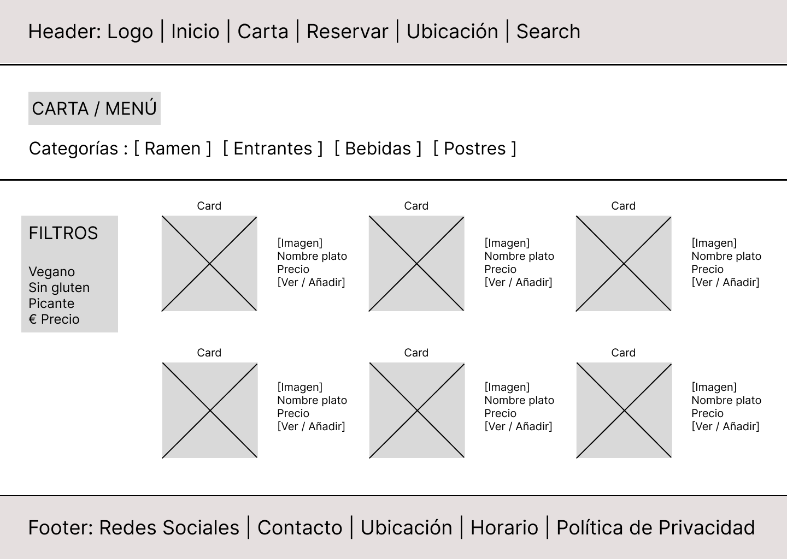

**Pantalla: Reserva Desktop**  
El proceso de reserva en desktop se organiza en dos zonas: un bloque principal con los pasos del formulario y un resumen lateral de la reserva. Esta estructura permite que el usuario complete los datos y revise la información antes de confirmar.

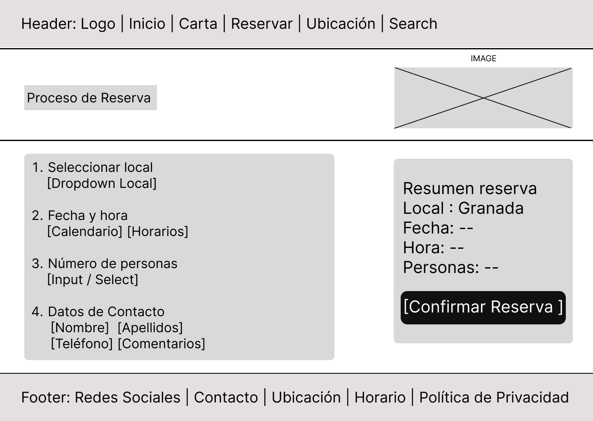

### 2.i Conclusiones
----

A través del empathy map, el point of view, el scope canvas, el análisis de tareas, la arquitectura de la información y los wireframes, hemos definido una propuesta más centrada en las necesidades reales del usuario.

La solución mantiene el atractivo visual y temático de Anime Ramen, pero introduce mejoras orientadas a la claridad, la consulta de la carta, la visibilidad de la información útil y la reserva online. Como equipo, consideramos que esta etapa nos ha permitido transformar los problemas detectados en la Práctica 1 en decisiones de diseño más justificadas, coherentes y aplicables a una futura versión.

## Paso 3. Mi UX-Case Study (diseño)

En la tercera práctica se ha pasado de los modelos low-fi definidos en la Práctica 2 a una propuesta más cercana al producto final. Para ello, se ha desarrollado una guía visual mediante moodboard, un sistema de diseño ligero basado en Atomic Design y una estructura de componentes en Figma preparada para construir los layouts Hi-Fi.

El objetivo de esta fase ha sido mantener la personalidad temática de **Anime Ramen**, pero construyendo una interfaz más clara, consistente y reutilizable. La propuesta visual equilibra la estética anime/gastronómica del restaurante con una experiencia más legible, funcional y orientada a tareas como consultar la carta, revisar platos y reservar mesa.

### 3.a Moodboard

-----

Para definir la dirección del rediseño de **Anime Ramen**, se elaboró un moodboard centrado en mantener la personalidad temática del restaurante, pero con una interfaz más clara y ordenada. El moodboard funciona como guía visual inicial para tomar decisiones sobre color, tipografía, iconografía, estilo de imagen y tono de comunicación.

La propuesta combina una estética inspirada en el ramen y en la cultura visual japonesa con una estructura más limpia y funcional. Se seleccionó una paleta de colores cálida y contrastada, donde el rojo funciona como color principal de acción, el negro aporta contraste, y los tonos crema, marrón y gris cálido suavizan la interfaz y mejoran la legibilidad.

En cuanto a tipografía, se eligió **Space Grotesk** para títulos y elementos destacados, por su carácter moderno y reconocible, e **Inter** para textos funcionales, botones, filtros y contenido de lectura, por su buena legibilidad en pantalla. Esta combinación permite mantener una personalidad visual marcada sin comprometer la claridad.

El moodboard también incluye referencias visuales de platos, logotipo, iconos y estilo de composición, que posteriormente se trasladaron al sistema de diseño y al layout Hi-Fi. El logotipo y los recursos visuales se plantearon como parte de una identidad más consistente para el rediseño, manteniendo la relación con el universo ramen y la estética temática del restaurante.

La resolución y composición del moodboard están pensadas principalmente para documentar el proceso de diseño dentro del case study.

**Herramientas utilizadas:** Figma para la organización del moodboard, pruebas de paleta, tipografía e integración de referencias visuales, y uso de IA generativa de imágenes como apoyo para componer el logotipo.

**Moodboard PDF:** [Moodboard Anime Ramen](P3/Moodboard_AnimeRamen.pdf)

### 3.b Landing Page
-----

>>> Realizado como Activida de teoría | NO se lleva a cabo en esta práctica 3-

### 3.c Guidelines
-----

Para la fase de prototipado se ha construido un **Design System ligero** basado en Atomic Design. El objetivo ha sido organizar los elementos visuales y funcionales del rediseño en componentes reutilizables, manteniendo consistencia entre pantallas y facilitando la creación de layouts Hi-Fi.

La estructura del sistema en Figma se ha organizado en cuatro niveles principales: foundations, átomos, moléculas y organismos.

#### Foundations

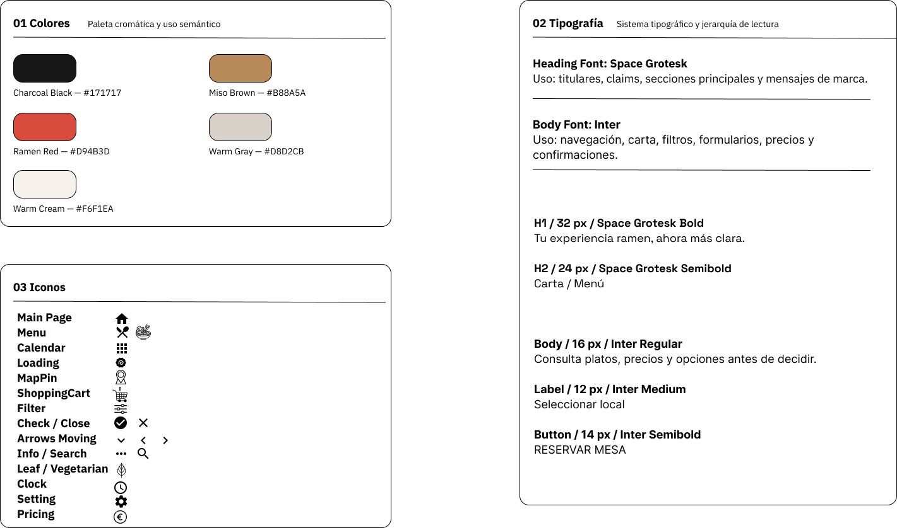

En la página de foundations se documentaron los elementos base del lenguaje visual:

- Paleta de colores.
- Tipografías principales.
- Jerarquía de texto.
- Iconografía.
- Estilo visual general.
- Criterios básicos de contraste y legibilidad.

Los colores principales definidos son el negro carbón, el rojo ramen, tonos crema, marrones y grises cálidos. Esta paleta mantiene el carácter visual del restaurante, pero permite construir una interfaz más clara y equilibrada.

La tipografía se organiza con **Space Grotesk** para titulares y mensajes destacados, e **Inter** para navegación, carta, filtros, formularios, precios y confirmaciones. También se definieron niveles de jerarquía como H1, H2, Body, Label y Button.

#### Átomos

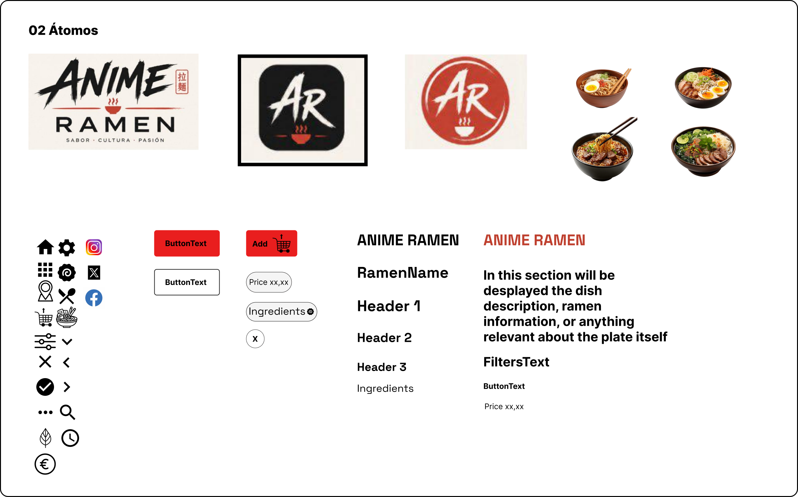

Los átomos representan las unidades mínimas reutilizables de la interfaz. En el proyecto se crearon componentes para botones, iconos, textos, imágenes de producto, chips informativos, inputs y acciones básicas.

Ejemplos de átomos creados:

- Button / Primary.
- Button / Secondary.
- Button / Add Product.
- Button / Pay.
- Input / Search.
- Chip / Ingredients.
- Chip / Price.
- Icon / Cart.
- Icon / Search.
- Icon / Location.
- Icon / Settings.
- Text / Header.
- Text / Price.
- Imágenes de producto.
- Versiones de logotipo.

Estos átomos permiten mantener una base visual coherente y reutilizable para construir elementos más complejos.

#### Moléculas

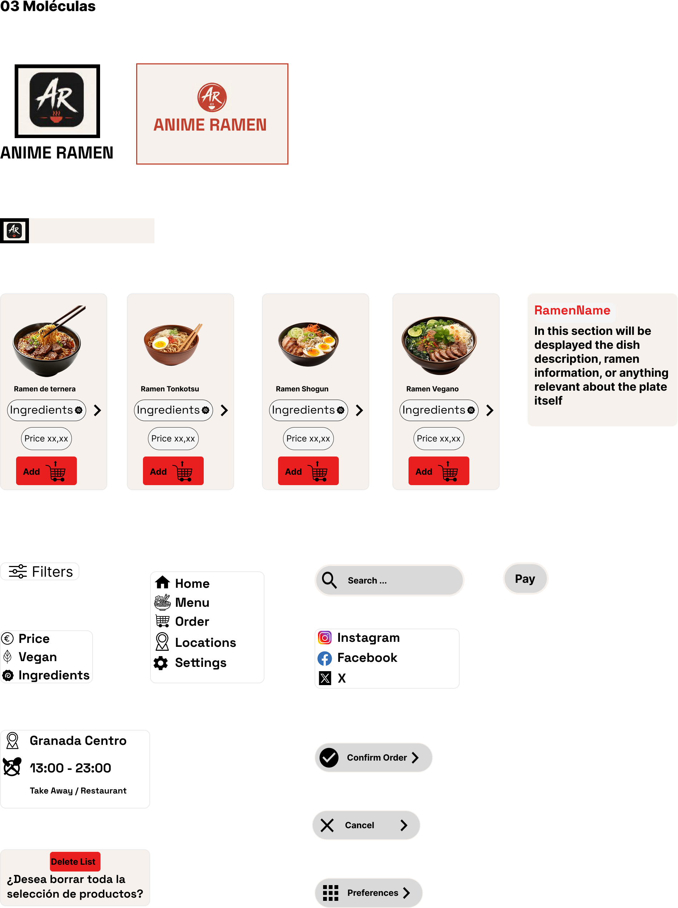

Las moléculas combinan varios átomos para formar unidades funcionales más completas. Una de las principales moléculas creadas fue la tarjeta de producto de ramen, formada por imagen, nombre, chips informativos y botón de añadir.

También se desarrollaron moléculas orientadas a navegación, búsqueda, filtros, contacto, redes sociales y acciones de confirmación o cancelación.

Ejemplos de moléculas creadas:

- Molecule / Ramen Card.
- Molecule / Header básico.
- Molecule / Description Ramen.
- Molecule / Search Bar.
- Molecule / Nav Item.
- Molecule / Filters.
- Molecule / Options Dropdown.
- Molecule / Contact Item.
- Molecule / Social Dropdown.
- Molecule / Accept.
- Molecule / Cancel.
- Molecule / Settings.
- Molecule / Alert Delete Product.

Estas moléculas permiten construir bloques funcionales sin tener que rediseñar cada elemento desde cero.

#### Organismos

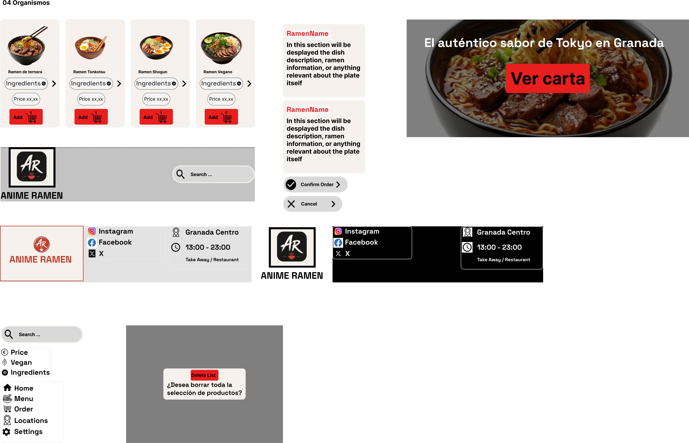

Los organismos combinan moléculas para formar secciones completas de la interfaz. Estos componentes se utilizaron como base para construir las pantallas Hi-Fi.

Ejemplos de organismos creados:

- Grid de productos / menú.
- Cabecera con buscador.
- Header / Hero Banner.
- Footer.
- Footer alternativo.
- Organismo de filtros y navegación.
- Pop-up de alerta.
- Bloques informativos de producto.

El uso de componentes, instancias y Auto Layout en Figma permitió mantener la consistencia visual y facilitar la adaptación responsive entre móvil y escritorio.

### 3.d Mockup
-----

A partir de los diseños low-fi definidos en la Práctica 2, se han construido los diseños o mockups Hi-Fi en Figma. El objetivo ha sido transformar los bocetos iniciales en pantallas visualmente acabadas, aplicando la paleta de colores, tipografías, imágenes, componentes, jerarquía visual y estilo definido en el moodboard.

Los mockups Hi-Fi mantienen la misma estructura y los mismos flujos que los wireframes low-fi. No se plantean pantallas nuevas, sino una evolución visual de las pantallas ya definidas previamente.

El diseño Hi-Fi se ha construido utilizando los componentes foundations, átomos, moléculas y organismos. Esto permite mantener una mayor coherencia visual entre pantallas y facilita que los cambios de estilo o componentes se propaguen de forma controlada.

#### Mockups Hi-Fi móvil

En formato móvil, se han trabajado las mismas cuatro pantallas principales definidas en los wireframes low-fi: Home, Carta, Proceso de reserva y Confirmación de reserva.

**Pantalla: Home móvil**  
La pantalla de inicio presenta la identidad visual del restaurante y prioriza los accesos principales a la carta y a la reserva.

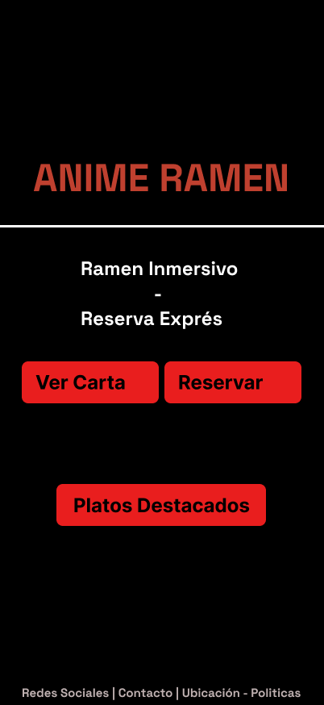

**PDF:** [HiFi Home Móvil](P3/HiFi_Home_Movil.pdf)

**Pantalla: Carta móvil**  
La carta digital permite consultar los platos mediante una estructura visual basada en tarjetas, filtros e información clara sobre cada producto.

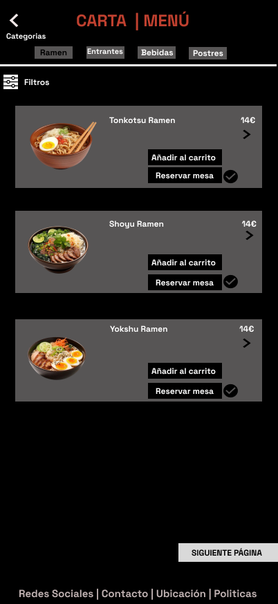

**PDF:** [HiFi Carta Móvil](P3/HiFi_Carta_Movil.pdf)

**Pantalla: Reserva móvil**  
El proceso de reserva organiza la información en pasos claros para facilitar la selección de local, fecha, hora, número de personas y datos de contacto.

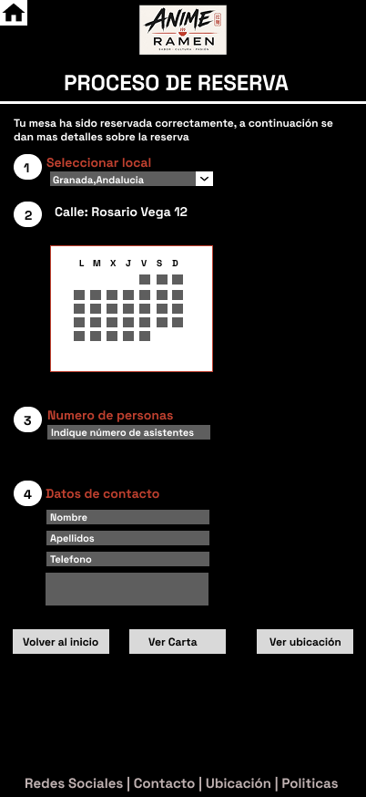

**PDF:** [HiFi Reserva Móvil](P3/HiFi_Reserva_Movil.pdf)

**Pantalla: Confirmación de reserva móvil**  
La pantalla final proporciona feedback inmediato al usuario y confirma que la acción se ha completado correctamente.

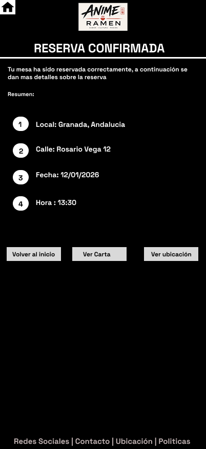

**PDF:** [HiFi Confirmación Reserva Móvil](P3/HiFi_Confirm_Reserva_Movil.pdf)

#### Mockups Hi-Fi desktop

En formato desktop, se han trabajado las tres adaptaciones responsive definidas en los low-fi: Home, Carta y Reserva. Estas versiones aprovechan el espacio horizontal para mejorar la jerarquía visual, organizar mejor los contenidos y facilitar la consulta de información.

**Pantalla: Home desktop**  
La versión de escritorio de la home amplía la composición mediante un hero más visual, una sección de productos destacados y bloques de información útil.

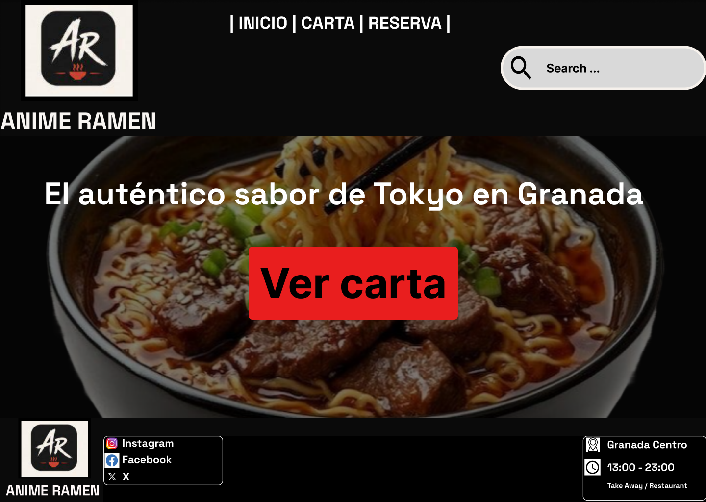

**PDF:** [HiFi Home PC](P3/HiFi_Home_PC.pdf)

**Pantalla: Carta desktop**  
La carta en escritorio utiliza una estructura más amplia, con navegación superior, filtros laterales y grid de productos, facilitando la comparación entre platos.

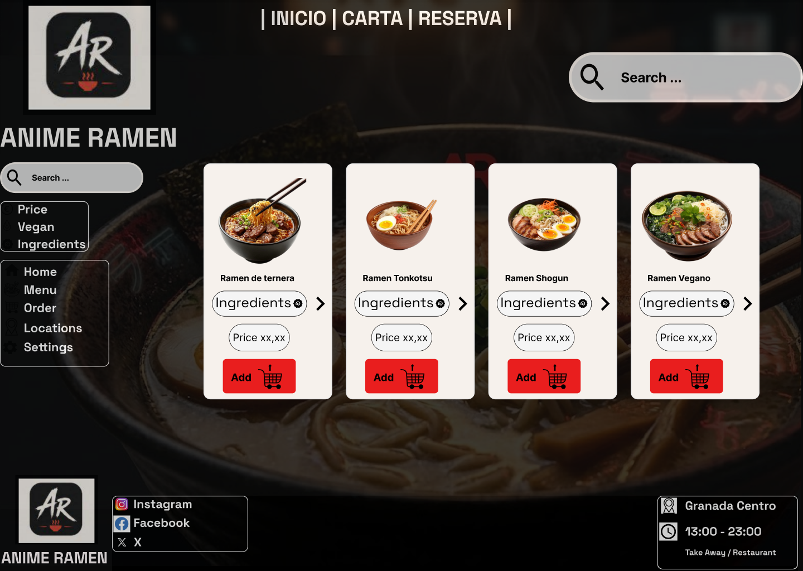

**PDF:** [HiFi Carta PC](P3/HiFi_Carta_PC.pdf)

**Pantalla: Reserva desktop**  
La reserva en escritorio se organiza con un formulario principal y un resumen lateral, permitiendo al usuario completar los datos y revisar la información antes de confirmar.

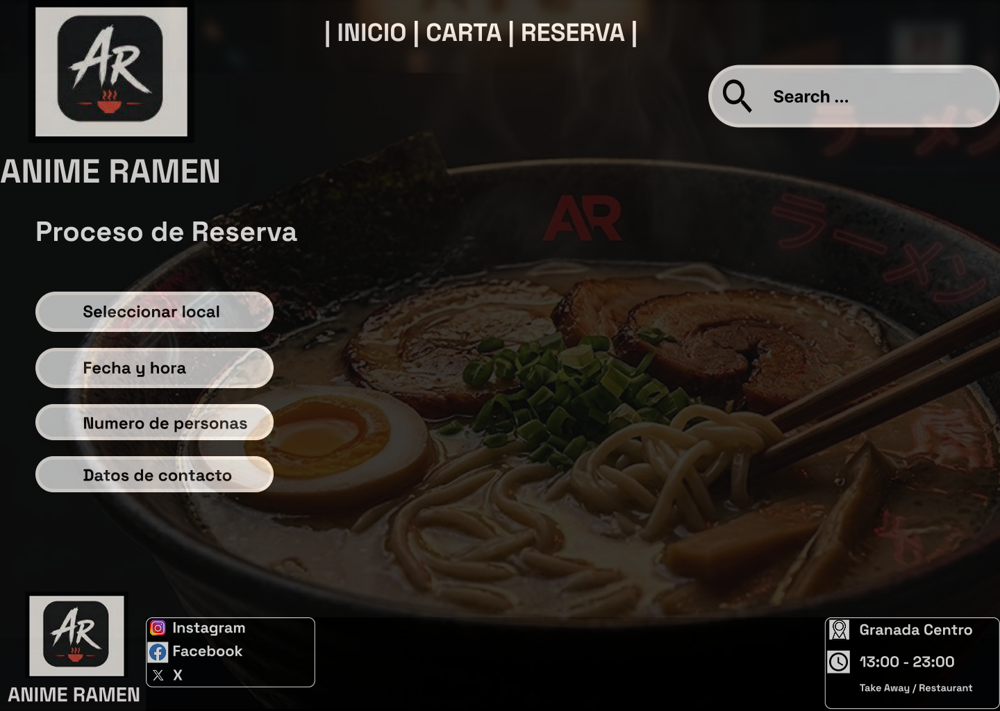

**PDF:** [HiFi Reserva PC](P3/HiFi_Reserva_PC.pdf)

En conjunto, los mockups Hi-Fi permiten comprobar cómo la propuesta visual se aplica sobre los flujos definidos anteriormente, manteniendo la coherencia entre móvil y escritorio y reforzando la claridad de las acciones principales del sitio.

### 3.e Briefing y conclusiones
-----

La Práctica 3 ha permitido transformar la propuesta definida en las fases anteriores en una interfaz visualmente más acabada y coherente. A partir del moodboard se estableció una dirección visual basada en una estética cálida, temática y gastronómica, manteniendo la identidad de Anime Ramen pero mejorando la legibilidad y la organización de la información.

El sistema de diseño basado en Atomic Design facilitó la creación de componentes reutilizables y consistentes.

Como conclusión, la propuesta final mantiene el atractivo visual del restaurante, pero lo organiza en una experiencia más clara y orientada a las tareas principales: consultar la carta, revisar platos y avanzar hacia la reserva.

 

## Paso 4. Pruebas de Evaluación 

### 4.a Reclutamiento de usuarios 

-----

>>> Breve descripción del caso asignado (llamado Caso-B) con enlace al repositorio Github
>>> Tabla y asignación de personas ficticias (o reales) a las pruebas. Exprese las ideas de posibles situaciones conflictivas de esa persona en las propuestas evaluadas. Mínimo 4 usuarios: asigne 2 al Caso A y 2 al caso B.

| Usuarios | Sexo/Edad     | Ocupación   |  Exp.TIC    | Personalidad | Plataforma | Caso
| ------------- | -------- | ----------- | ----------- | -----------  | ---------- | ----
| User1's name  | H / 18   | Estudiante  | Media       | Introvertido | Web.       | A 
| User2's name  | H / 18   | Estudiante  | Media       | Timido       | Web        | A 
| User3's name  | M / 35   | Abogado     | Baja        | Emocional    | móvil      | B 
| User4's name  | H / 18   | Estudiante  | Media       | Racional     | Web        | B 

### 4.b Diseño de las pruebas 
 
-----

>>> Planifique qué pruebas se van a desarrollar. ¿En qué consisten? ¿Se hará uso del checklist de la P1?

### 4.c Cuestionario SUS
 
----

>>> Como uno de los test para la prueba A/B testing, usaremos el **Cuestionario SUS** que permite valorar la satisfacción de cada usuario con el diseño utilizado (casos A o B). Para calcular la valoración numérica y la etiqueta linguistica resultante usamos la [hoja de cálculo](https://github.com/mgea/DIU19/blob/master/Cuestionario%20SUS%20DIU.xlsx). Previamente conozca en qué consiste la escala SUS y cómo se interpretan sus resultados
http://usabilitygeek.com/how-to-use-the-system-usability-scale-sus-to-evaluate-the-usability-of-your-website/)
Para más información, consultar aquí sobre la [metodología SUS](https://cui.unige.ch/isi/icle-wiki/_media/ipm:test-suschapt.pdf)
>>> Adjuntar en la carpeta P4/ el excel resultante y describa aquí la valoración personal de los resultados 

### 4.d A/B Testing
 
-----

>>> Los resultados de un A/B testing con 3 pruebas y 2 casos o alternativas daría como resultado una tabla de 3 filas y 2 columnas, además de un resultado agregado global. Especifique con claridad el resultado: qué caso es más usable, A o B?

### 4.e Aplicación del método Eye Tracking 

----

>>> Indica cómo se diseña el experimento y se reclutan los usuarios. Explica la herramienta / uso de gazerecorder.com u otra similar. Aplíquese únicamente al caso B.

  
>>> Cambiar esta img por una de vuestro experimento. El recurso deberá estar subido a la carpeta P4/  

>>> gazerecorder en versión de pruebas puede estar limitada a 3 usuarios para generar mapa de calor (crédito > 0 para que funcione) 

### 4.f Usability Report de B
 
-----

>>> Añadir report de usabilidad para práctica B (la de los compañeros) aportando resultados y valoración de cada debilidad de usabilidad. 
>>> Enlazar aqui con el archivo subido a P4/ que indica qué equipo evalua a qué otro equipo.

>>> Complementad el Case Study en su Paso 4 con una Valoración personal del equipo sobre esta tarea

 

## Paso 5. Exportación y Documentación 

### 5.a Exportación a HTML/React
 
----

>>> Breve descripción de esta tarea. Las evidencias de este paso quedan subidas a P5/

### 5.b Documentación con Storybook

----

>>> Breve descripción de esta tarea. Las evidencias de este paso quedan subidas a P5/

 

## Conclusiones finales & Valoración de las prácticas

>>> Opinión FINAL del proceso de desarrollo de diseño siguiendo metodología UX y valoración (positiva /negativa) de los resultados obtenidos. ¿Qué se puede mejorar? Recuerda que este tipo de texto se debe eliminar del template que se os proporciona 

