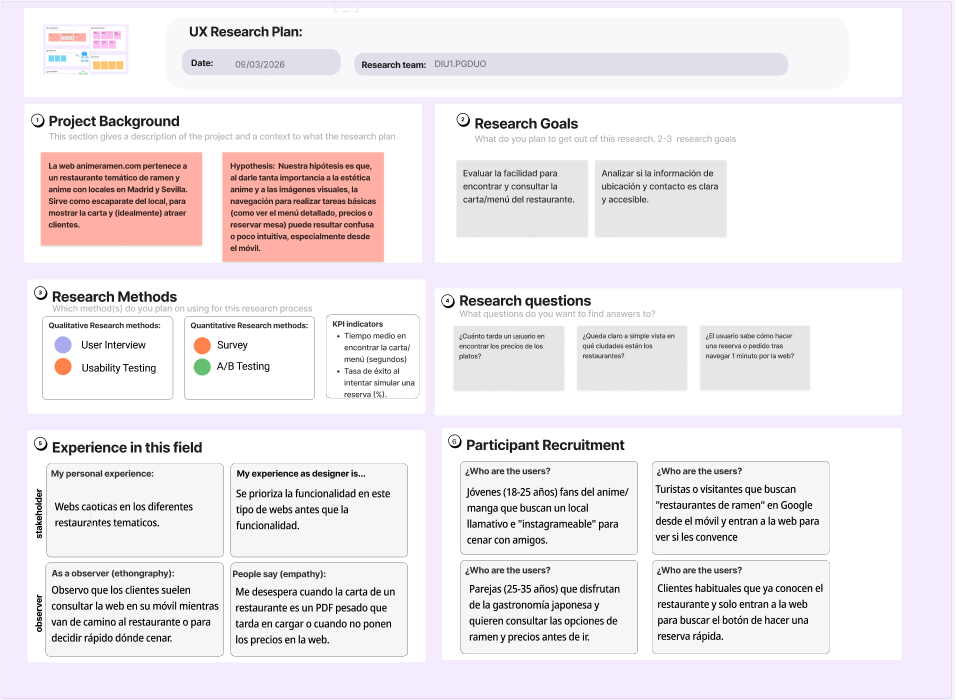
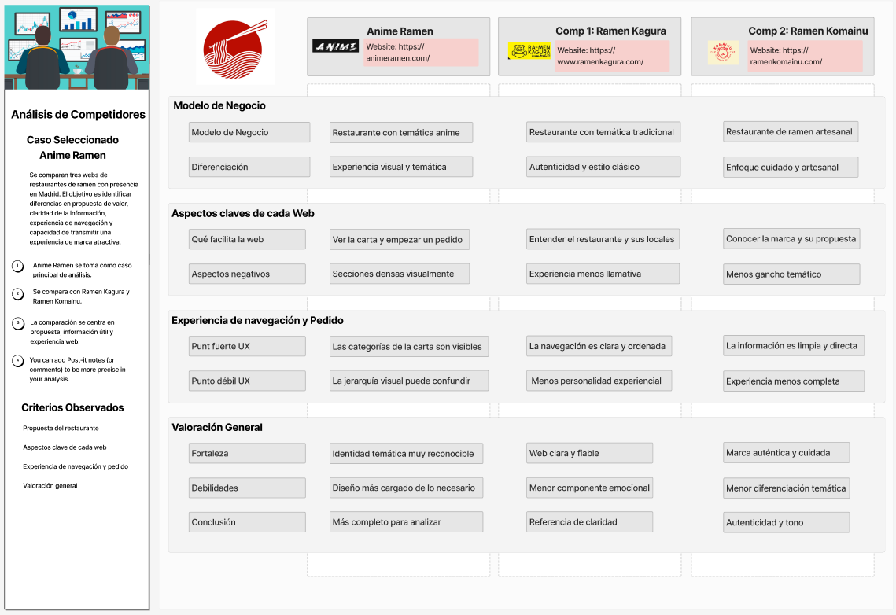
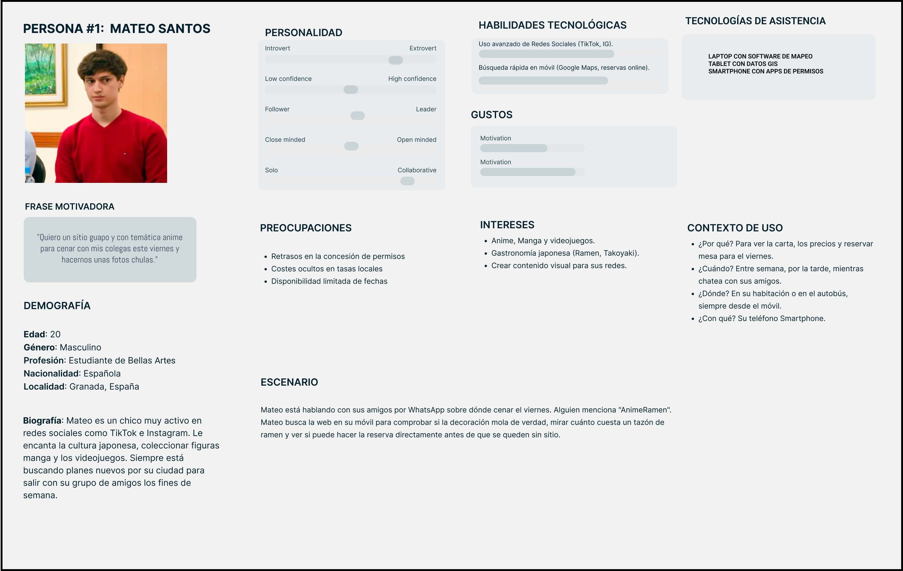
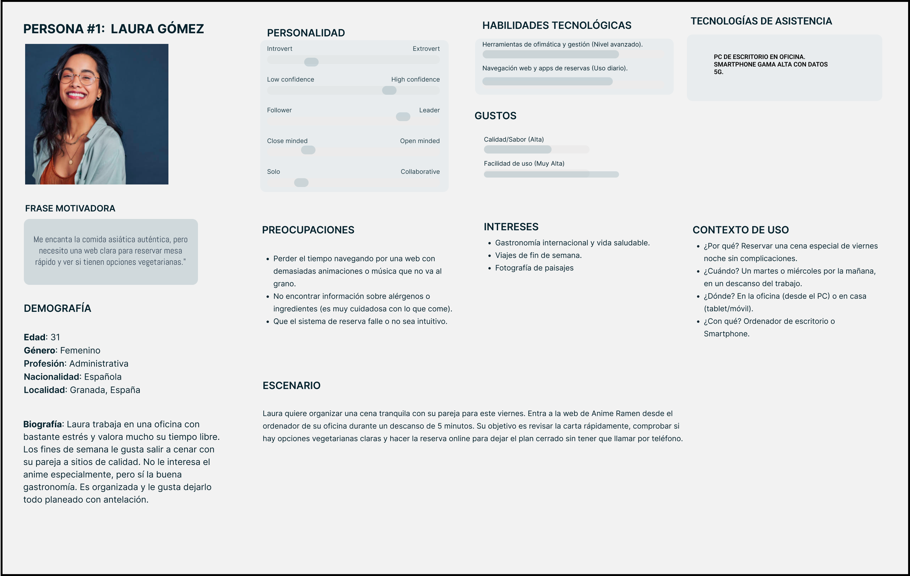
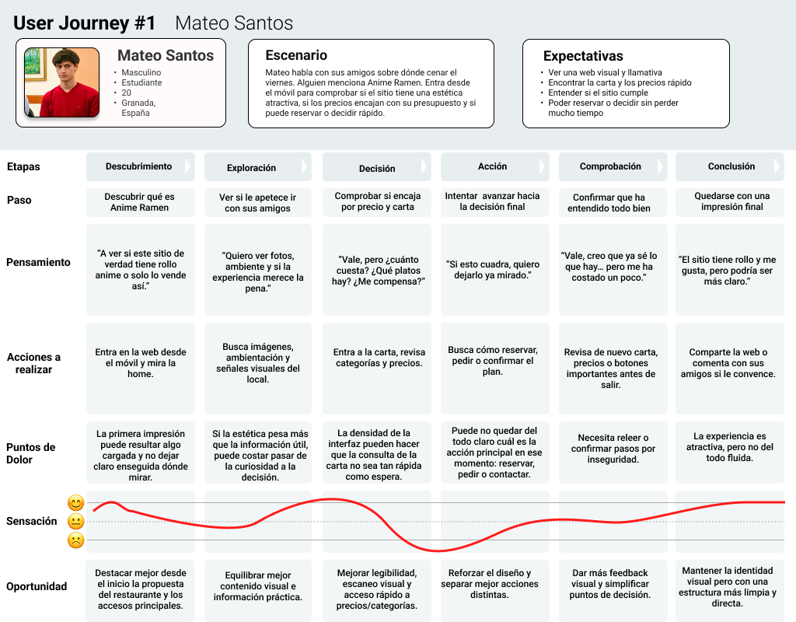
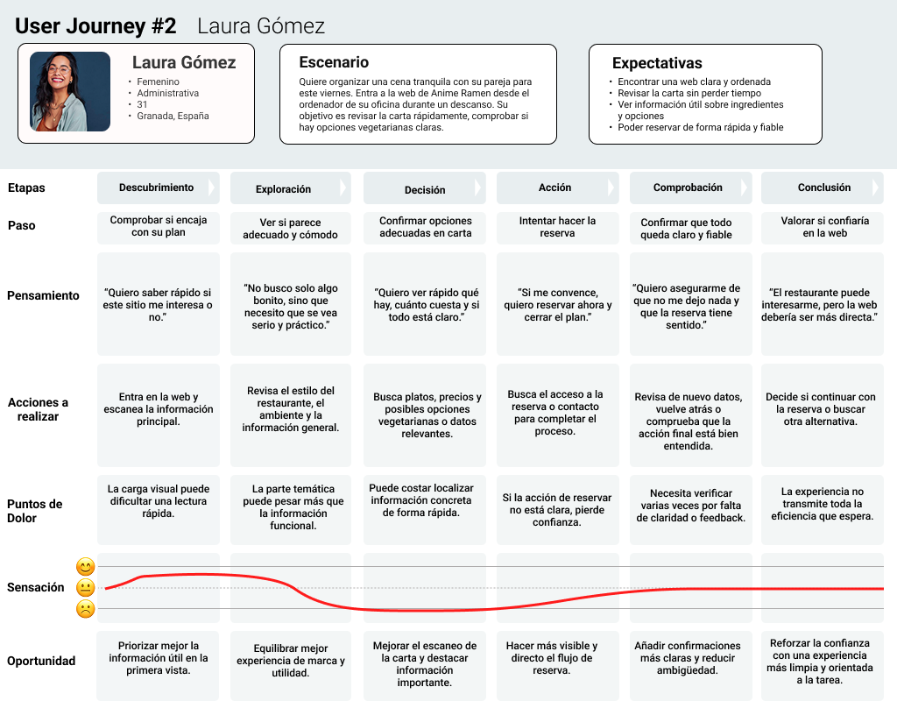

# DIU26
Prácticas Diseño Interfaces de Usuario  (Tema: Gastronomía / Sabores con encanto - DIU1 Anime Ramen)

* [Guiones de prácticas](GuionesPracticas/)
* [Guía para crea tu Case Study](Guia_CaseStudy.md)
* Sala de la Fama [DIU Hall of fame](https://github.com/mgea/DIU/tree/master/hall_of_fame) donde se pueden encontrar Case Study destacados de otros años.
* [Recursos/plantillas en figma](https://www.figma.com/design/BN2IR0q2clOSplfMmalh9K/DIU_Toolkit_Framework--2026-)

Actualizado: 18/03/2026

## Paso 0 My UX-Case Study
 
-----

Grupo: DIU1.PGduo.  Curso: 2025/26 

Nombre del Proyecto: Pendiente de definición en la Práctica 2

Descripción: Pendiente de definición en la Práctica 2

Logotipo: Pendiente de definición en la Práctica 3

Miembros y nombre del equipo:
 * :bust_in_silhouette:  Pablo Anel Rancaño         :octocat: [pabloanelrancano](https://github.com/pabloanelrancano)
 * :bust_in_silhouette:  Germán Morcillo Jimenez    :octocat: [germanmorcillo](https://github.com/germanmorcillo)

----- 

 

# Proceso de Diseño 

 

## Paso 1. UX User & Desk Research & Analisis 

### 1.a User Reseach Plan

-----

Para investigar la web del restaurante **Anime Ramen**, nos hemos centrado en tres aspectos clave: la facilidad para consultar la carta, la claridad de la información sobre ubicación y contacto, y lo intuitivo que resulta el proceso de reserva. Partimos de la hipótesis de que el fuerte peso de la estética anime y de los elementos visuales puede dificultar tareas básicas como consultar precios, revisar la carta o avanzar hacia la reserva, especialmente en móvil.

Como referencia de usuarios, se consideraron perfiles jóvenes atraídos por la temática visual y perfiles más interesados en la oferta gastronómica y en la rapidez del proceso. El plan sirvió como base para el análisis competitivo, la definición de personas, los journey maps y la revisión heurística posterior.

### 1.b Competitive Analysis
 
-----

Para el análisis competitivo del grupo **DIU1** se seleccionó como caso principal la web de **Anime Ramen**, ya que encaja directamente con la temática asignada y combina una identidad visual muy marcada con tareas digitales claras, como consultar la carta, iniciar un pedido, localizar el restaurante o acceder a la reserva.

Como referencia competitiva se comparó Anime Ramen con **Ramen Kagura** y **Ramen Komainu**, dos restaurantes de ramen con presencia en Madrid que permiten contrastar enfoques distintos. Ramen Kagura destaca por una web más clara y estructurada, con una propuesta más tradicional y confiable, mientras que Ramen Komainu cuenta con una imagen más artesanal y auténtic. Frente a ellos, Anime Ramen sobresale por su diferenciación visual y experiencial, pero también presenta una interfaz más densa y una jerarquía visual menos limpia.

### 1.c Personas
 
-----

**1. Mateo Santos (Estudiante y fan del anime):** Representa al público joven. Busca una experiencia inmersiva y visual para compartir con amigos. Al tener un presupuesto ajustado, su prioridad es encontrar la carta con los precios de forma rápida, pero se frustra si la web es lenta o caótica.

 
-----
**2. Laura Gómez (Profesional pragmática):** Representa a un público más adulto y ocupado. Valora su tiempo y la calidad de la comida. Necesita que la interfaz sea limpia, que la información sobre alérgenos/opciones vegetarianas sea clara y que el proceso de reserva online sea impecable y rápido.

### 1.d User Journey Map

 
----

El primer **User Journey Map** se basa en **Mateo Santos**, un usuario joven y fan del anime que entra en la web desde el móvil tras una recomendación de sus amigos. Su objetivo es comprobar rápidamente si **Anime Ramen** le convence como plan de grupo, fijándose sobre todo en la estética del sitio, la carta con precios visibles y la posibilidad de reservar o decidir con rapidez.

El recorrido muestra una situación habitual: descubrir un restaurante, revisar si encaja con el plan, consultar carta y precios y valorar una posible reserva. La web funciona bien como elemento de atracción inicial, pero aparecen ocasiones que pueden no ser tan agradables para el usuario como cuando, este necesita consultar información práctica de forma rápida. En especial, la densidad visual, la jerarquía de la información y la falta de claridad en algunas acciones dificultan la toma de decisiones.

**Conclusión:** Anime Ramen destaca por su identidad visual y capacidad de atraer, pero necesita mejorar la claridad de la carta y la visibilidad de las acciones principales.

 
----

El segundo **User Journey Map** se construye a partir de **Laura Gómez**, una usuaria más pragmática y orientada a la eficiencia. Su objetivo es revisar la carta con rapidez, encontrar información útil y completar una reserva sin perder tiempo. En este caso, el recorrido se centra menos en la parte emocional y más en la claridad, la utilidad y la confianza que transmite la interfaz.

Este mapa refleja una situación muy frecuente en webs de restauración: entrar con una intención concreta, comprobar si la oferta encaja y completar una acción práctica. La web transmite personalidad, pero para este perfil todavía puede mejorar en legibilidad, escaneo de contenidos y visibilidad de la reserva.

**Conclusión:** para usuarios más funcionales, Anime Ramen necesita una experiencia más clara, directa y orientada a la tarea.

### 1.e Usability Review
 
----

La revisión de usabilidad de **Anime Ramen** se realizó mediante la checklist propuesta, teniendo en cuenta también las necesidades detectadas en las personas y en los journey maps. El resultado global obtenido fue de **58/100**, con una valoración **Moderate**.

La evaluación muestra como punto fuerte principal la identidad visual del sitio, ya que desde el inicio se entiende bien el concepto de restaurante temático. Sin embargo, también aparecen debilidades importantes: exceso de carga visual, jerarquía mejorable, dificultades para escanear rápidamente la carta y una reserva que podría ser más clara y directa.

**Evidencia de la revisión:** [Usability Review PDF](P1/Usability-review-template-Anime-Ramen.pdf)

**Valoración numérica obtenida**: 58/100

**Conclusión:** Anime Ramen destaca por su personalidad y capacidad de atraer, pero necesita mejorar en claridad, legibilidad y orientación a la tarea.  

 

## Paso 2. UX Design  

>>> Cualquier título puede ser adaptado. Recuerda borrar estos comentarios del template en tu documento

### 2.a Reframing / IDEACION: Feedback Capture Grid / EMpathy map 
 
----

>>> Comenta con un diagrama los aspectos más destacados a modo de conclusion de la práctica anterior. De qué carece la competencia?? Tu diagrama puede ser una figura subida a la carpeta P2/

 Interesante | Críticas     
| ------------- | -------
  Preguntas | Nuevas ideas
  
    
>>> Explica el Problema y plantea una hipótesis. Es decir, explica aquí qué 
>>> se plantea como "propuesta de valor" para un nuevo diseño de aplicación propio

### 2.b ScopeCanvas

----

>>> Propuesta de valor, pero ahora en vez de un texto es un ScopeCanvas que has subido a P2/ y enlazado desde aqui. Tambien vale una imagen miniatura del recurso.
>>> No olvides que tu propuesta ya tiene un nombre corto y puedes actualizar la cabecera de este archivo

### 2.b User Flow (task) analysis 
 
-----

>>> Definir "User Map" y "Task Flow" ... enlazar desde P2/ y describir brevemente

### 2.c IA: Sitemap + Labelling 
 
----

>>> Identificar términos para diálogo con usuario (evita el spanglish) y la arquitectura de la información. Es muy apropiado un diagrama tipo sitemap y una tabla que se ampliaría para llevar asociado la columna iconos (tanto para la web como para una app). 

Término | Significado     
| ------------- | -------
  Login  | acceder a plataforma

### 2.d Wireframes
 
-----

>>> Plantear el diseño del layout para Web/movil (organización y simulación). Describa la herramienta usada 

 

## Paso 3. Mi UX-Case Study (diseño)

>>> Cualquier título puede ser adaptado. Recuerda borrar estos comentarios del template en tu documento

### 3.a Moodboard

-----

>>> Diseño visual con una guía de estilos visual (moodboard) 
>>> Incluir Logotipo. Todos los recursos estarán subidos a la carpeta P3/
>>> Explique aqui la/s herramienta/s utilizada/s y el por qué de la resolución empleada. Reflexione ¿Se puede usar esta imagen como cabecera de Instagram, por ejemplo, o se necesitan otras?

### 3.b Landing Page
 
----

>>> Plantear el Landing Page del producto. Aplica estilos definidos en el moodboard

### 3.c Guidelines
 
----

>>> Estudio de Guidelines y explicación de los Patrones IU a usar 
>>> Es decir, tras documentarse, muestre las deciones tomadas sobre Patrones IU a usar para la fase siguiente de prototipado. 

### 3.d Mockup
 
----

>>> Consiste en tener un Layout en acción. Un Mockup es un prototipo HTML que permite simular tareas con estilo de IU seleccionado. Muy útil para compartir con stakeholders

 

## Paso 4. Pruebas de Evaluación 

### 4.a Reclutamiento de usuarios 

-----

>>> Breve descripción del caso asignado (llamado Caso-B) con enlace al repositorio Github
>>> Tabla y asignación de personas ficticias (o reales) a las pruebas. Exprese las ideas de posibles situaciones conflictivas de esa persona en las propuestas evaluadas. Mínimo 4 usuarios: asigne 2 al Caso A y 2 al caso B.

| Usuarios | Sexo/Edad     | Ocupación   |  Exp.TIC    | Personalidad | Plataforma | Caso
| ------------- | -------- | ----------- | ----------- | -----------  | ---------- | ----
| User1's name  | H / 18   | Estudiante  | Media       | Introvertido | Web.       | A 
| User2's name  | H / 18   | Estudiante  | Media       | Timido       | Web        | A 
| User3's name  | M / 35   | Abogado     | Baja        | Emocional    | móvil      | B 
| User4's name  | H / 18   | Estudiante  | Media       | Racional     | Web        | B 

### 4.b Diseño de las pruebas 
 
-----

>>> Planifique qué pruebas se van a desarrollar. ¿En qué consisten? ¿Se hará uso del checklist de la P1?

### 4.c Cuestionario SUS
 
----

>>> Como uno de los test para la prueba A/B testing, usaremos el **Cuestionario SUS** que permite valorar la satisfacción de cada usuario con el diseño utilizado (casos A o B). Para calcular la valoración numérica y la etiqueta linguistica resultante usamos la [hoja de cálculo](https://github.com/mgea/DIU19/blob/master/Cuestionario%20SUS%20DIU.xlsx). Previamente conozca en qué consiste la escala SUS y cómo se interpretan sus resultados
http://usabilitygeek.com/how-to-use-the-system-usability-scale-sus-to-evaluate-the-usability-of-your-website/)
Para más información, consultar aquí sobre la [metodología SUS](https://cui.unige.ch/isi/icle-wiki/_media/ipm:test-suschapt.pdf)
>>> Adjuntar en la carpeta P4/ el excel resultante y describa aquí la valoración personal de los resultados 

### 4.d A/B Testing
 
-----

>>> Los resultados de un A/B testing con 3 pruebas y 2 casos o alternativas daría como resultado una tabla de 3 filas y 2 columnas, además de un resultado agregado global. Especifique con claridad el resultado: qué caso es más usable, A o B?

### 4.e Aplicación del método Eye Tracking 

----

>>> Indica cómo se diseña el experimento y se reclutan los usuarios. Explica la herramienta / uso de gazerecorder.com u otra similar. Aplíquese únicamente al caso B.

  
>>> Cambiar esta img por una de vuestro experimento. El recurso deberá estar subido a la carpeta P4/  

>>> gazerecorder en versión de pruebas puede estar limitada a 3 usuarios para generar mapa de calor (crédito > 0 para que funcione) 

### 4.f Usability Report de B
 
-----

>>> Añadir report de usabilidad para práctica B (la de los compañeros) aportando resultados y valoración de cada debilidad de usabilidad. 
>>> Enlazar aqui con el archivo subido a P4/ que indica qué equipo evalua a qué otro equipo.

>>> Complementad el Case Study en su Paso 4 con una Valoración personal del equipo sobre esta tarea

 

## Paso 5. Exportación y Documentación 

### 5.a Exportación a HTML/React
 
----

>>> Breve descripción de esta tarea. Las evidencias de este paso quedan subidas a P5/

### 5.b Documentación con Storybook

----

>>> Breve descripción de esta tarea. Las evidencias de este paso quedan subidas a P5/

 

## Conclusiones finales & Valoración de las prácticas

>>> Opinión FINAL del proceso de desarrollo de diseño siguiendo metodología UX y valoración (positiva /negativa) de los resultados obtenidos. ¿Qué se puede mejorar? Recuerda que este tipo de texto se debe eliminar del template que se os proporciona 

